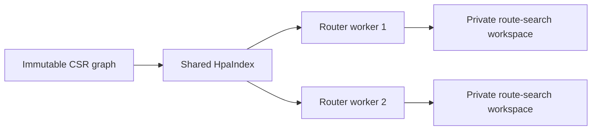

# Weighted HPA* for the directed BusMap graph

## Contract

The code provides only Weighted HPA* with stored shortcut paths, defaulting to L=3500 m, w=1.05.
Workspaces are always reused across queries; exact and fresh modes have been removed.
See the [measurements and verification results](HPA_RESULTS.md).

HPA in this project is a hierarchical routing variant that retains all boundary vertices.
The route search uses Weighted A* with `w>1`. The API and CLI reject `w=1`.
Dijkstra precomputes internal distances and paths. Weighted A* searches each query's route;
shortcuts are expanded by reading and concatenating stored paths. There is no option to
change storage or rerun searches inside clusters. Query results are not cached.
[Historical path-storage comparison](HPA_PATH_STORAGE.md).

The graph is immutable, with directed edges and nonnegative weights in meters. Results use
`PathResult` and the existing v1 text contract. A graph must outlive the indexes, Routers,
and QueryPools that reference it.

## Reading the code

Start reading [hpa.cpp](../cpp/src/hpa.cpp) from its two orchestration functions:

1. `HpaIndex::HpaIndex()` runs once. `partition_nodes()` partitions clusters;
   `find_portals_and_heuristic_scale()` finds portals and the heuristic scale;
   `build_shortcuts()` calls `run_cluster_dijkstra()` from each portal, then
   `store_shortcut_paths()` stores paths. `finalize_storage_statistics()` shrinks
   arrays and calculates index memory.
2. `hpa()` runs for each query. After input validation, `search_overlay()` uses
   Weighted A* to find a route; `reconstruct_path()` concatenates real edges and
   stored shortcut paths through `append_shortcut_path()`.

[hpa.hpp](../cpp/include/busmap/hpa.hpp) describes the data: shared `HpaIndex` and
private `HpaWorkspace` per worker. `workspace.search` holds search state;
`workspace.heuristic` stores h by NodeId, valid only for the current query;
`workspace.abstract_path` holds the route before shortcut expansion. In the heap,
`priority` is f, `distance_from_source` is g, and `node` is the vertex to process.
`parent_is_shortcut` indicates whether the step from parent to vertex is a shortcut or original edge.
The index's two offset arrays locate a vertex's shortcut list and a shortcut's detailed path;
comments beside each array specify its indexing scheme.

## Partitioning

For `L=cluster_size_m`, take `x0=min(x_m)`, `y0=min(y_m)` and assign vertex u to
`(floor((x(u)-x0)/L), floor((y(u)-y0)/L))`. Store only cells containing vertices.
Sort cell keys for stable cluster IDs; vertices within each cell retain NodeId order.

L is in meters, not a vertex count. NodeId carries no geographic-region meaning.
A cluster may contain disconnected components, including components connected in only one direction.
This does not require changing topology or adding edges. Sizes so small that cell coordinates
exceed int64 are explicitly rejected.

An edge `u→v` with `cluster(u)!=cluster(v)` marks **both endpoints** as portals.
Retain the original edge and direction, even when it skips multiple cells. Cells are not
assumed to be adjacent, and reverse edges are not added automatically.

## Dijkstra preprocessing

For each portal p in cluster C:

```text
reset touched distances
Dijkstra(p), relaxing edge u→v only if cluster(v)=C
when another portal q is settled:
    record shortcut p→q with the settled distance
    stop if all other portals have been settled
if the heap is empty: the remaining portals are unreachable
for each shortcut p→q created:
    trace Dijkstra parents from q to p, then reverse
    store vertices after p through q in the CSR path array
```

Unreachable pairs have no shortcut. `p→q` and `q→p` are computed independently.
A shortcut may pass through other portals in the same cluster; its weight is always the
shortest distance restricted to that cluster.

The index stores shortcut CSR and full paths, the vertex→cluster mapping, portal flags,
and the heuristic scale. `path_offsets` maps each shortcut to a slice of `path_nodes`;
the slice omits the source vertex for direct concatenation. Dijkstra parents are temporary
build arrays released after the constructor. Preprocessing distance/heap storage is reused.

Let `n_C`, `m_C`, and `b_C` denote vertex, internal-edge, and portal counts:

- Build: `O(Σ b_C (n_C+m_C) log n_C + total vertices in shortcut paths)`, using the usual bound.
- Maximum shortcut count: `Σ b_C(b_C−1)`; only reachable pairs are stored.
- Index: `O(N + shortcut count + total vertices in shortcut paths)` beyond the original graph.
- Query workspace: `O(N + heap + path length)` per worker.

`index_bytes` includes the object and capacities of index-owned vectors; it excludes the graph,
allocator overhead, and temporary build memory. `build_ms` measures index construction;
`router_setup_ms` also includes ownership management and executor setup.

## Search graph dependent on S and T

S is not connected to every portal through a series of independent searches. Instead,
route search uses a combined graph:

```text
if u is in cluster(S) or cluster(T):
    relax all original outgoing edges of u
otherwise:
    relax original edges u→v into other clusters
    relax internal shortcuts leaving u
```

Only portals enter the heap for intermediate clusters. The first/last clusters are expanded
in detail using real edges. They are expanded only once if S and T are in the same region.
Leaving and re-entering the first/last regions is allowed; there is no incorrect fast path
that restricts same-cluster queries to internal search.

Each relaxation records the predecessor, step weight, and original/shortcut flag.
Heap order `(f,g,NodeId)` and deterministic edge/shortcut order ensure reproducibility.
Updates require strict `g` improvement; stale entries are discarded before the goal check,
and vertices may reopen. No closed set blocks later improvements.

## Heuristic and quality bound

Define `d(u,v)=hypot(x_u-x_v,y_u-y_v)`:

```text
alpha = min(1, min over edges with d>0 of weight(u,v)/d(u,v))
h(u,T) = alpha * d(u,T)
```

Reduce alpha slightly to avoid upward rounding. If no finite geometric bound can be computed,
use 0; a zero-weight edge between distinct coordinates also forces alpha=0.
By the triangle inequality, h is a lower bound on both the original graph and shortcuts.
Synthetic fixtures are not assumed to follow the dataset's geometric weights.

The main phase uses `f=g+w*h` with `w>1`.
With a valid lower bound, reopening, and termination when the goal is popped from a valid
heap entry, path cost is at most `w*optimum` under exact arithmetic.
Verification uses the project's common floating-point tolerance.

The maximum 5% bound at w=1.05 does not imply p95 ≤1%. Tuning separately filters for
p95 gap ≤1% and maximum gap ≤5% over distinct queries.

## Path expansion

Trace predecessors backward from the main phase, then reverse the step order.

- Real edge: append its target vertex to the result.
- Shortcut p→q: locate the corresponding CSR slice and append its stored full path.
- Join segments without duplicating the connecting vertex at the start of the new segment.
- Sum real edge weights for the returned distance; check that each segment cost matches
  its shortcut weight within tolerance.

The workspace serves route search and reconstruction only. The heap is a vector that reuses
capacity; only distances at touched vertices are reset. The returned path vector belongs to
the result and is not overwritten by the next query.

The heuristic is computed when a vertex is first discovered (`distance[v] == infinity`),
before writing a finite g; the source is initialized separately. Later g improvements or
reopenings reuse the stored h. Reset returns touched distances to infinity, so the next query
recomputes h when it encounters the vertex: there is no need to clear the entire heuristic
vector or add a marker array. Resizing initializes additional elements only when the graph
size changes. The cache stores h before multiplication by w, does not use values from prior
queries, and is not part of the preprocessing Dijkstra workspace. Additional memory is
N × sizeof(double).

## The combined graph preserves the optimal distance

Every original path can be split into internal segments alternating with inter-cluster edges.
Retaining all portals and inter-cluster edges means replacing each intermediate segment with
a shortest shortcut cannot increase cost. Conversely, every shortcut has a real path of the
same cost within its cluster. These mappings show that the combined graph's optimum equals
the original graph's optimum. This also applies to disconnected clusters, paths returning
to earlier clusters, and S/T in the same region. The Weighted bound on the combined graph
therefore also bounds cost relative to the original graph's optimum.

## Integration and running

`HpaIndex` is immutable and bound to a graph. Router accepts `HpaOptions` and
`shared_ptr<const HpaIndex>`. If no index is supplied, setup creates one.
QueryPool creates/validates the index synchronously before starting workers; every worker
uses the same shared pointer and a private workspace. Indexes for another graph or cluster
size are rejected. The index is not built inside queries.

Router retains the capacities of `distance`, `parent`, `parent_edge_weight`,
`parent_is_shortcut`, `touched_nodes`, `heap`, `heuristic`, and `abstract_path` across queries.
Each worker has its own workspace; the entire workspace is not created/destroyed per call.
`workspace_bytes()` reports total retained capacity, excluding result paths, allocator
metadata, and the index.

```sh
cmake -S . -B build -DCMAKE_BUILD_TYPE=Release
cmake --build build --parallel 4
./build/busmap-query --graph data/processed/graph.txt \
  --queries benchmarks/queries.txt --algorithm hpa \
  --hpa-cluster-size 3500 --hpa-weight 1.05 --threads 4
./scripts/bench.sh hpa
./scripts/bench.sh hpa --hpa-cluster-size 3500 --hpa-weight 1.02 --mode any
```

Defaults are L=3500 m and w=1.05. HPA benchmarks default to the `any` checker;
Dijkstra/A* use `optimal`. `--mode` selects only the checker criterion, not the algorithm.
Use `--mode optimal` to require optimality; the checker fails if Weighted search returns a
longer path. HPA options with other algorithms, nonpositive/nonfinite L, and w≤1/nonfinite w
are all rejected.

### Using C++

```cpp
const auto graph = busmap::load_graph("data/processed/graph.txt");
busmap::HpaOptions options{3500, 1.05};
auto index = std::make_shared<busmap::HpaIndex>(graph, options.cluster_size_m);
busmap::Router router(graph, busmap::Algorithm::Hpa, options, index);
auto result = router.query({0, source, target});

// Share the index; each worker owns its workspace.
busmap::QueryPool pool(graph, busmap::Algorithm::Hpa, 4, 64, options, index);
auto future = pool.submit({1, source, target});
auto parallel_result = future.get();
```

Do not call `router.query()` concurrently on the same Router. Use a pool or a separate
Router per thread. Changing `options.heuristic_weight` within `w>1` does not require
rebuilding the index; its structure depends on the graph and cluster size.



## Measurement and tuning

```sh
python3 scripts/tune_hpa.py --output-dir artifacts/hpa-tuning --budget-minutes 60
```

Standard Python is sufficient for measurement/checking; install matplotlib to generate
PNG/SVG, or use `--render-only artifacts/hpa-tuning` with a Python environment containing
matplotlib after measurement. The script copies the executable into the session so every
experiment uses the same binary.

Generate 1,000 tuning queries with seed 162164, excluding all sources in the existing
1,000-query held-out suite. Use an independent Python Dijkstra oracle. Do not modify the original suite.

Coarse sweep: L=250/500/750/1000/1500/2000/3000/4000/6000/8000/12000 meters,
w=1.005/1.01/1.02/1.05; one process, one warm-up, three measured batches.
Take the two best Weighted sizes and add 0.75/0.875/1.125/1.25 multiples,
rounded to 50 m within [125,24000]. The fine round includes the original candidates so all
are measured in three new processes, with one warm-up and five batches. Shuffle order by seed.

Select by the median of mean service time across three processes. Within 3% of the fastest
candidate, break ties by p95, index RAM, build time, L, then w. This is a selection rule,
not a statistical confidence interval. Consider only configurations that pass correctness
and quality requirements. Write locked.json before held-out evaluation.

Held-out: three processes, two warm-ups, ten batches. Also compare four workers with queue 64,
three processes, one warm-up, and five batches. Divide the deadline into 45 minutes for tuning
and 15 minutes for final evaluation. If too few fine-round candidates finish, do not treat
the coarse round as a final conclusion. Do not retune on held-out results when quality fails.

Service includes route search, path concatenation, and allocations within the query. Loading,
index construction, checking, and serialization are outside the query timer. Each batch retains
all paths until the end for checking. Peak RSS therefore differs from index_bytes. The workspace
metric is the largest capacity observed in one worker, not total pool RSS.

`--hpa-diagnostics` on busmap-bench adds a separate instrumented pass after measured batches,
writing diagnostics.csv: `search_ns`, `reconstruction_ns`, expansions, relaxations,
stale heap entries, shortcuts used, peak heap size, and workspace capacity growth events.
`heuristic_requests` counts h values requested for priorities; `heuristic_evaluations`
counts actual calls to `HpaIndex::heuristic`. Their difference is the cache-hit count.
`timing.json.hpa.heuristic_cache` is `per_query`, with `heuristic_cache_invalidation`
set to `first_touch`. Workspace bytes include heuristic vector capacity.
Do not use timings from this pass as the standard query benchmark.

## Verification

`ctest --test-dir build --output-on-failure` runs HPA, CLI, worker pool, benchmark,
and HCMC comparison tests. HPA tests use 100 random graphs, all pairs, multiple L/w values,
and independent Floyd–Warshall; they check internal closure, edge direction, reachability,
actual cost, and the Weighted bound. Fixtures add paths leaving/re-entering the same cluster,
zero-weight edges, zero cycles, long-jump edges, and isolated vertices.

Sanitizers use a separate build with `-fsanitize=address,undefined`; do not measure performance
with a sanitizer binary. Older compilers/runtimes may not support current macOS; use a newer
LLVM if the sanitizer fails before main.
