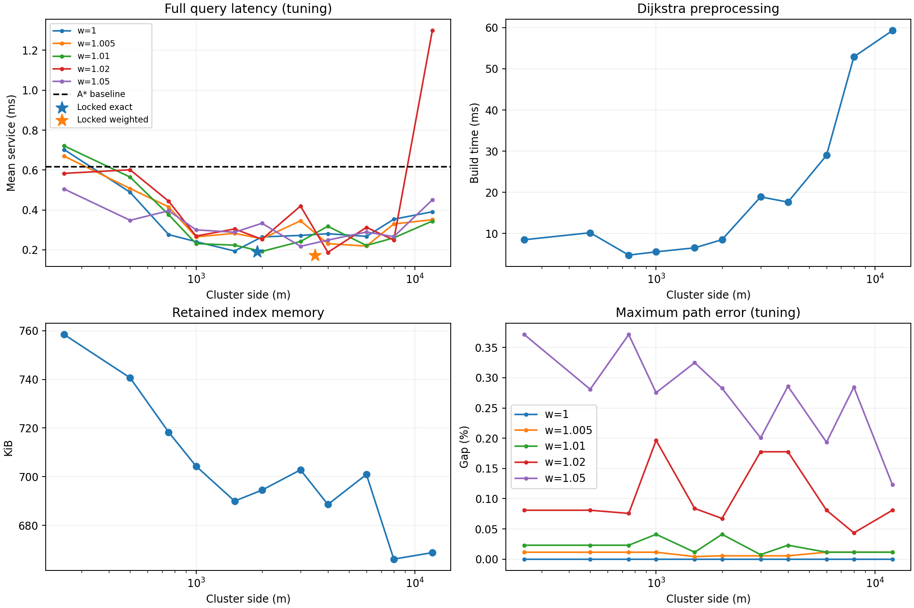

# HPA* implementation and tuning results — 2026-09-18

> Historical report for the version supporting exact/Weighted search. Current code retains
> only Weighted search, default L=3500 m, w=1.05, and reusable workspaces. Measurements and
> hashes below refer to the binary stored in artifacts; current source no longer supports exact commands.

**Default: exact HPA, 1,900 m clusters, w=1.** On the independent 1,000-query evaluation suite,
queries are **3.21 times** faster than A*, including detailed path construction.
The selected Weighted variant uses 3,500 m clusters, w=1.05, and is **3.44 times** faster than A*.

## One-worker results

Each timing cell is a median across three independent processes, each with two warm-ups
and ten measured batches. Paths are checked in every batch.

| Algorithm | Mean query | p95 query | Queries/second | Build index | Index RAM | p95 error | Maximum error |
|---|---:|---:|---:|---:|---:|---:|---:|
| Dijkstra | 988.61 µs | 1903.96 µs | 1,011 | — | — | 0% | 0% |
| A* | 602.76 µs | 2242.13 µs | 1,659 | — | — | 0% | 0% |
| HPA exact: 1,900 m | **187.54 µs** | **591.79 µs** | **5,331** | 7.15 ms | 692.9 KiB | 0% | 0% |
| HPA Weighted: 3,500 m, w=1.05 | **175.35 µs** | **478.00 µs** | **5,702** | 13.08 ms | 704.1 KiB | 0.0141% | 1.2516% |

Floating-point errors near 1e-13% are rounded to 0 in the table. Weighted meets p95 ≤1%
and maximum ≤5% on the evaluation suite. The configuration was locked before using this suite;
neither L nor w was changed based on evaluation results.

Exact was selected as the default because it guarantees shortest paths. Weighted is about
6.5% faster than exact over this workload, but short queries are not necessarily faster:
the short-group mean is 85.37 µs versus 71.34 µs for exact. The Weighted long-group mean is
256.00 µs versus 310.29 µs for exact. Algorithms are not switched automatically by query length.

Preprocessing breaks even relative to A* after about **18 queries** for exact and **31 queries**
for Weighted, based on measured mean query savings. These are estimates for this graph and
workload, excluding differences in cold starts or background load.

## Four workers

| Algorithm | Throughput | Process peak RSS |
|---|---:|---:|
| Dijkstra | 2,412 query/s | 7.95 MiB |
| A* | 4,259 query/s | 9.06 MiB |
| HPA exact | **16,936 query/s** | 14.67 MiB |
| HPA Weighted | **17,994 query/s** | 14.75 MiB |

Queue capacity is 64. Each worker has a private workspace and shares one immutable index.
Index RAM covers index-owned storage; peak RSS also includes the graph, workspaces, threads,
and all paths retained within the batch. Paths are byte-identical between one/four workers
and independent processes using the same configuration.

## Configuration selection

- Fixed graph: 38,148 vertices, 42,170 directed edges.
- Generate 1,000 tuning queries with seed 162164, excluding the evaluation suite's 294 sources.
- Coarse sweep: 55 L/w combinations; fine sweep: 49 combinations, three processes each.
- Select by median mean query time; the 3% tie band prioritizes p95, index RAM, and build time.
- Total: **230 processes, 1,088 batches, 1,088,000 checked query results**.
- No failed batches or abandoned configurations; duration about **22.9 minutes**.
- No query-result or refined-path cache. Only the distance index, heap, and workspace are reused.



Chart lines show the one-process coarse round; stars show three-process medians from the fine
round. Coarse results have background-load variation, especially one 12 km, w=1.02 point;
that measurement is retained and not used as the final conclusion. The opening table uses
three-process held-out measurements. The 3% band is a selection rule, not a confidence interval.

## Profiling and optimization decisions

A separate instrumented pass on the tuning suite shows:

| Mode | Route search | Refine | Refinement share | High-level pops/query | Internal pops/query |
|---|---:|---:|---:|---:|---:|
| Exact | 173.00 µs | 18.06 µs | 9.5% | 1241.9 | 362.7 |
| Weighted | 152.00 µs | 24.09 µs | 13.7% | 1072.5 | 426.2 |

The main cost is high-level route search. Weighted search/larger clusters reduce high-level
pops but increase refinement. Cluster size is therefore selected using full-query time,
not only portal count or search time alone.

The code used shortcut CSR, reusable heaps, and touched resets from the start. Only 10 exact
queries and 9 Weighted queries in profiling caused workspace capacity growth. No path cache
or refinement-algorithm change was added, and no algorithm changes followed configuration locking.
Instrumented timings do not replace the service measurements in the opening table.

## Verification and reproduction

- Release CTest: all loader, HPA, pool, concurrency, CLI, and benchmark tests.
- HPA: 100 small graphs, all pairs, four cluster sizes, and three heuristic weights;
  independent Floyd–Warshall oracle. Includes a test forcing Weighted A* to reopen vertices.
- Tests cover zero-weight edges/cycles, disconnected graphs, edge direction, leaving/re-entering
  the same cluster, skipping multiple cells, self-queries, invalid IDs, and indexes for the wrong graph.
- Python: all 25 data/checker/tuning tests; three integration classes run through CTest because
  they require executables.
- AddressSanitizer + UndefinedBehaviorSanitizer: LLVM 22 in a separate build. AppleClang 14's
  sanitizer cannot start on the current OS; Release uses AppleClang 14.0.3, C++20, arm64 macOS.

```sh
# Exact: defaults were already L=1900, w=1
./scripts/bench.sh hpa

# Selected Weighted configuration
./scripts/bench.sh hpa --hpa-cluster-size 3500 --hpa-weight 1.05 --mode any

# Rerun everything; choose a new directory
.venv/bin/python scripts/tune_hpa.py --output-dir artifacts/hpa-new-run --budget-minutes 60
```

The measured binary was snapshotted before the experiment and retained in the session.
After evaluation, only default L changed from 2000 to 1900; measurements passed L explicitly,
so this choice did not change the measured algorithm. The final build was rechecked with
the new default. Both binary hashes are in report.json and the
[selected configuration](../benchmarks/hpa-recommended.json).

- [Design, pseudocode, API, and proof](HPA_DESIGN.md)
- [Full report](../artifacts/hpa-tuning-20260918/report.md)
- [Raw report JSON](../artifacts/hpa-tuning-20260918/report.json)
- [Configuration CSV](../artifacts/hpa-tuning-20260918/configuration_summary.csv)
- Raw timing, paths, checker output, and profiling are under `artifacts/hpa-tuning-20260918/runs/`.

The tuning and held-out suites have disjoint sources but share one historical graph; they do not
represent real traffic or every map. Measurements apply to the current machine, not guaranteed
performance on other hardware or workloads.
